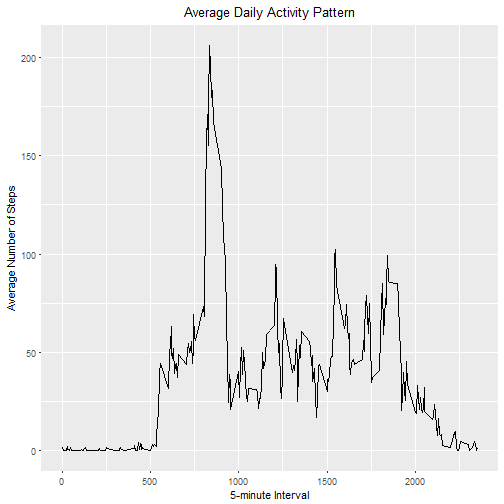

download data

```r
fileUrl <- "https://d396qusza40orc.cloudfront.net/repdata%2Fdata%2Factivity.zip"
download.file(fileUrl, destfile = "C:/research/john hopkins R/reproducible research/week 1/activity.zip")
list.files("C:/research/john hopkins R/reproducible research/week 1")
```

```
##  [1] "activity.csv"                         
##  [2] "activity.zip"                         
##  [3] "figure"                               
##  [4] "organizingADataAnalysis.pdf"          
##  [5] "PA1_template.html"                    
##  [6] "PA1_template.md"                      
##  [7] "PA1_template.Rmd"                     
##  [8] "PA1_template.Rmd.html"                
##  [9] "Reproducible_Research_Project_1_files"
## [10] "ReproResearch.pdf"                    
## [11] "structureOfADataAnalysis1.pdf"        
## [12] "structureOfADataAnalysis2.pdf"
```

unzip and read data

```r
if (!file.exists('activity.csv')) {
  unzip(zipfile = "activity.zip")
}
activity.data <- read.csv(file="activity.csv", header=TRUE)
```

### 1. What is mean total number of steps taken per day?

```r
# how many steps taken per day
total.steps <- aggregate(steps ~ date, activity.data, FUN=sum)

# create a histogram
hist(total.steps$steps,
     main = "Total Steps per Day",
     xlab = "Number of Steps")
```


Calculate the mean and median of total steps taken per day

```r
mean.steps <- mean(total.steps$steps, na.rm = TRUE)
med.steps <- median(total.steps$steps, na.rm = TRUE)
mean.steps
```

```
## [1] 10766.19
```

```r
med.steps
```

```
## [1] 10765
```
### mean of total steps taken per day is 10766.19
### median of total steps taken per day is 10765

### 2. What is the average daily activity pattern?

```r
# Make a time-series plot with 5-minute interval as xlab and the average number of
# steps taken as ylab, across all days
library(ggplot2)
mean.steps.by.int <- aggregate(steps ~ interval, activity.data, mean)
ggplot(data = mean.steps.by.int, aes(x = interval, y = steps)) +
  geom_line() +
  ggtitle("Average Daily Activity Pattern") +
  xlab("5-minute Interval") +
  ylab("Average Number of Steps") +
  theme(plot.title = element_text(hjust = 0.5))
```



```r
# find 5-minute interval contains the maximum number of steps
max.int <- mean.steps.by.int[which.max(mean.steps.by.int$steps),]
max.int
```

```
##     interval    steps
## 104      835 206.1698
```
### 5-minute interval 835 contains the max number of steps, which is 206 steps

### 3. Imputing missing values
how many missing values in the entire dataset

```r
# Calculate and report the total number of records in which "steps" is missing
table(is.na(activity.data$steps))
```

```
## 
## FALSE  TRUE 
## 15264  2304
```
### there are 2304 missing values in total

### my strategy is to replace missing value of a 5-minute interval with the mean of that interval

### Create a new dataset that is equal to the original dataset but with the missing data filled in

```r
activity.data.new <- transform(activity.data,
                               steps = ifelse(is.na(activity.data$steps),
                               mean.steps.by.int$steps[match(activity.data$interval, 
                               mean.steps.by.int$interval)],
                               activity.data$steps))
# check again to see whether missing values exist
table(is.na(activity.data.new$steps))
```

```
## 
## FALSE 
## 17568
```
### missing values have been filled in

### Make a histogram of the total number of steps taken each day

```r
new.steps.by.int <- aggregate(steps ~ date, activity.data.new, FUN=sum)
hist(new.steps.by.int$steps,
     main = "Number of Steps Per Day (with missing values filled in)",
     xlab = "Number of Steps")
```


### Calculate and report the mean and median total number of steps taken per day

```r
new.mean.steps <- mean(new.steps.by.int$steps, na.rm = TRUE)
new.med.steps <- median(new.steps.by.int$steps, na.rm = TRUE)
new.mean.steps
```

```
## [1] 10766.19
```

```r
new.med.steps
```

```
## [1] 10766.19
```

Do these values differ from the estimates from the first part of the assignment?

1. mean doesn't change

2. median becomes closer to mean as I used mean to filled in

### 4. Are there differences in activity patterns between weekdays and weekends?
### Create a new factor variable in the dataset with two levels - "weekday" and "weekend" indicating whether a given date is a weekday or weekend day.

```r
what.day <- function(date){
  day <- weekdays(date)
  if (day %in% c("Monday", "Tuesday", "Wednesday", "Thursday", "Friday"))
    return ("weekday")
  else if (day %in% c("Saturday", "Sunday"))
    return ("weekend")
  else
    stop ("Invalid Date Format.")
}
activity.data.new$date <- as.Date(activity.data.new$date)
activity.data.new$day <- sapply(activity.data.new$date, FUN = what.day)
# verify if there are only two levels
levels(as.factor(activity.data.new$day))
```

```
## [1] "weekday" "weekend"
```

### Make a panel plot containing a time series plot (i.e. type="l") of the 5-minute interval (x-axis) and the average number of steps taken, averaged across all weekday days or weekend days (y-axis).

```r
mean.steps.by.day <- aggregate(steps ~ interval + day, activity.data.new, mean)
ggplot(data = mean.steps.by.day, aes(x = interval, y = steps)) + 
  geom_line() +
  facet_grid(day ~ .) +
  ggtitle("Average Daily Activity Pattern") +
  xlab("5-minute Interval") +
  ylab("Average Number of Steps") +
  theme(plot.title = element_text(hjust = 0.5))
```


